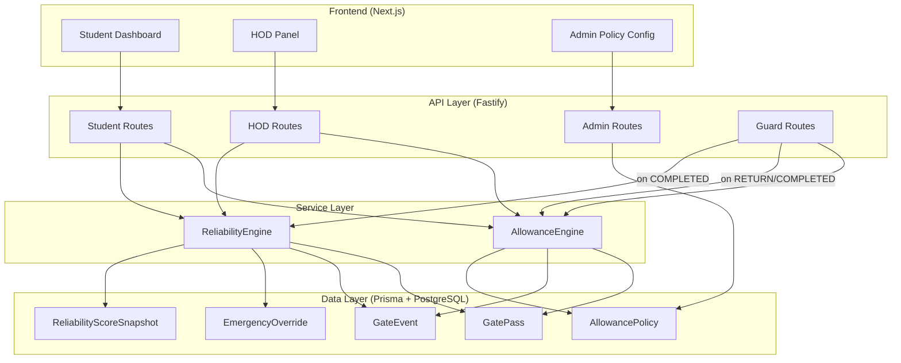
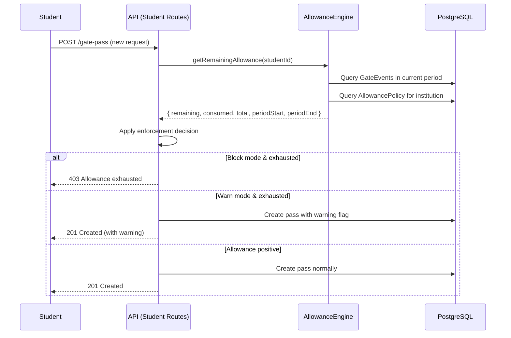
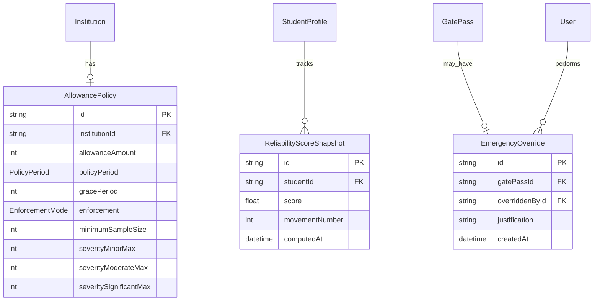

# Design Document: Outside-Time Allowance & Reliability Score

## Overview

This design introduces two interconnected subsystems to CAMPUSGATE:

1. **AllowanceEngine** — Tracks, computes, and enforces per-student outside-time budgets within configurable policy periods.
2. **ReliabilityEngine** — Computes an informational 0.0–5.0 reliability score from completed gate pass movements, reflecting gate pass discipline.

Both engines derive all metrics from existing `GateEvent` records (EXIT/RETURN timestamps), following a strict **Raw Facts → Derived Metrics → Interpretation** layering. No new mutable counters are introduced; all values are computed on-demand from immutable event data.

### Design Rationale

- **Derivation over storage**: Durations and scores are computed from GateEvent timestamps, not stored as mutable fields. This ensures auditability and eliminates drift between events and metrics.
- **Policy as data**: All configurable thresholds live in a database model (`AllowancePolicy`), enabling runtime changes without deployments.
- **Separation of concerns**: AllowanceEngine handles time-budget logic; ReliabilityEngine handles scoring. Both consume the same raw data but serve different purposes.
- **Non-blocking score**: The reliability score is purely informational — it never blocks workflow actions, preserving student agency while supporting HOD decision-making.

## Architecture



### Data Flow



## Components and Interfaces

### Service: AllowanceEngine

**Location:** `apps/api/src/services/allowance-engine.ts`

```typescript
interface AllowanceSummary {
  totalAllowance: number;        // in minutes
  consumed: number;              // in minutes (including in-progress)
  remaining: number;             // in minutes
  periodType: PolicyPeriod;
  periodStart: Date;
  periodEnd: Date;
  isExhausted: boolean;
  warningThreshold: boolean;     // remaining < 20% of total
  currentlyOutsideElapsed: number | null; // minutes if currently outside
}

interface PolicyConfig {
  allowanceAmount: number;       // minutes, [60, 10080]
  policyPeriod: PolicyPeriod;    // 'daily' | 'weekly' | 'monthly' | 'semester'
  gracePeriod: number;           // minutes, [0, 60]
  enforcement: EnforcementMode;  // 'block_new_requests' | 'warn_only'
  minimumSampleSize: number;     // [3, 20]
  severityThresholds: SeverityThresholds;
}

interface EnforcementDecision {
  action: 'allow' | 'block' | 'warn';
  message?: string;
  remainingAllowance: number;
}

// Public API
class AllowanceEngine {
  static async getRemainingAllowance(studentId: string, institutionId: string): Promise<AllowanceSummary>;
  static async getEnforcementDecision(studentId: string, institutionId: string): Promise<EnforcementDecision>;
  static async computeActualDuration(passId: string): Promise<number | null>;
  static getPeriodBounds(periodType: PolicyPeriod, referenceDate: Date): { start: Date; end: Date };
  static async getOrCreatePolicy(institutionId: string): Promise<PolicyConfig>;
}
```

### Service: ReliabilityEngine

**Location:** `apps/api/src/services/reliability-engine.ts`

```typescript
interface ReliabilityScore {
  overall: number;                    // 0.0–5.0, 1 decimal place
  components: {
    timelyReturnRate: number;         // 0.0–1.0
    completionRate: number;           // 0.0–1.0
    authorizationComplianceRate: number; // 0.0–1.0
  };
  totalMovements: number;
  hasSufficientData: boolean;
  trend: ScoreTrend | null;
}

interface ScoreTrend {
  snapshots: Array<{ score: number; date: Date; movementNumber: number }>;
  improvementIndicator: boolean;      // true if current - 10th_ago >= 0.5
}

type SeverityLevel = 'minor' | 'moderate' | 'significant' | 'severe';

interface SeverityThresholds {
  minor: { min: 1; max: number };     // default max: 15
  moderate: { min: number; max: number }; // default 16–60
  significant: { min: number; max: number }; // default 61–180
  severe: { min: number };            // default 181+
}

// Public API
class ReliabilityEngine {
  static async computeScore(studentId: string, institutionId: string): Promise<ReliabilityScore>;
  static async getScoreTrend(studentId: string, limit?: number): Promise<ScoreTrend>;
  static async recordSnapshot(studentId: string, score: number, movementNumber: number): Promise<void>;
  static classifySeverity(overdueMinutes: number, thresholds: SeverityThresholds): SeverityLevel;
  static computeTimelyReturnRate(movements: Movement[], gracePeriod: number, thresholds: SeverityThresholds): number;
  static computeCompletionRate(passes: GatePass[]): number;
  static computeComplianceRate(movements: Movement[]): number;
}
```

### API Endpoints (New)

| Method | Path | Auth | Purpose |
|--------|------|------|---------|
| GET | `/api/student/allowance` | STUDENT | Get allowance summary for current period |
| GET | `/api/student/reliability` | STUDENT | Get reliability score and trend |
| GET | `/api/hod/requests/:passId/allowance` | HOD | Get student's allowance when reviewing request |
| GET | `/api/hod/requests/:passId/reliability` | HOD | Get student's reliability score |
| POST | `/api/hod/emergency-override` | HOD | Create emergency override for blocked student |
| GET | `/api/admin/allowance-policy` | ADMIN | Get current policy config |
| PUT | `/api/admin/allowance-policy` | ADMIN | Update policy config |
| POST | `/api/admin/emergency-override` | ADMIN | Create emergency override (admin level) |

### Modified Endpoints

| Method | Path | Change |
|--------|------|--------|
| POST | `/api/student/gate-pass` | Add allowance enforcement check before creating pass |
| POST | `/api/guard/mark-return` | Trigger reliability snapshot computation on COMPLETED |
| GET | `/api/student/dashboard` | Include allowance summary in response |
| GET | `/api/hod/requests/:passId` | Include student allowance + reliability info |

## Data Models

### New Prisma Enums

```prisma
enum PolicyPeriod {
  DAILY
  WEEKLY
  MONTHLY
  SEMESTER
}

enum EnforcementMode {
  BLOCK_NEW_REQUESTS
  WARN_ONLY
}

enum SeverityLevel {
  MINOR
  MODERATE
  SIGNIFICANT
  SEVERE
}
```

### New Model: AllowancePolicy

```prisma
model AllowancePolicy {
  id              String          @id @default(cuid())
  institutionId   String          @unique
  institution     Institution     @relation(fields: [institutionId], references: [id])
  allowanceAmount Int             @default(1440)   // minutes, [60, 10080]
  policyPeriod    PolicyPeriod    @default(WEEKLY)
  gracePeriod     Int             @default(10)     // minutes, [0, 60]
  enforcement     EnforcementMode @default(WARN_ONLY)
  minimumSampleSize Int           @default(5)      // [3, 20]

  // Configurable severity thresholds (minutes past grace)
  severityMinorMax      Int @default(15)
  severityModerateMax   Int @default(60)
  severitySignificantMax Int @default(180)

  createdAt DateTime @default(now())
  updatedAt DateTime @updatedAt

  @@map("allowance_policies")
}
```

### New Model: EmergencyOverride

```prisma
model EmergencyOverride {
  id            String   @id @default(cuid())
  gatePassId    String
  gatePass      GatePass @relation(fields: [gatePassId], references: [id])
  overriddenById String
  overriddenBy  User     @relation("OverrideActor", fields: [overriddenById], references: [id])
  justification String   // min 10 characters
  createdAt     DateTime @default(now())

  @@map("emergency_overrides")
}
```

### New Model: ReliabilityScoreSnapshot

```prisma
model ReliabilityScoreSnapshot {
  id             String   @id @default(cuid())
  studentId      String
  student        StudentProfile @relation(fields: [studentId], references: [id])
  score          Float          // 0.0–5.0
  movementNumber Int            // sequential movement count at time of snapshot
  computedAt     DateTime @default(now())

  @@index([studentId, computedAt])
  @@map("reliability_score_snapshots")
}
```

### Modified Models

**GatePass** — add optional relation to EmergencyOverride:
```prisma
model GatePass {
  // ... existing fields ...
  emergencyOverride EmergencyOverride?
  allowanceWarning  String?   // set when pass created under warn_only with exhausted allowance
}
```

**Institution** — add relation to AllowancePolicy:
```prisma
model Institution {
  // ... existing fields ...
  allowancePolicy AllowancePolicy?
}
```

**User** — add relation for emergency overrides performed:
```prisma
model User {
  // ... existing fields ...
  emergencyOverrides EmergencyOverride[] @relation("OverrideActor")
}
```

**StudentProfile** — add relation to snapshots:
```prisma
model StudentProfile {
  // ... existing fields ...
  reliabilitySnapshots ReliabilityScoreSnapshot[]
}
```

### AuditAction Enum Extension

```prisma
enum AuditAction {
  // ... existing values ...
  EMERGENCY_OVERRIDE
  ALLOWANCE_POLICY_UPDATED
}
```

### Entity Relationship (New Models)



## Key Algorithms

### Actual Duration Computation

```typescript
function computeActualDuration(exitEvent: GateEvent, returnEvent: GateEvent): number {
  // Duration in minutes, always derived from events
  return Math.floor(
    (returnEvent.timestamp.getTime() - exitEvent.timestamp.getTime()) / (1000 * 60)
  );
}
```

### Period Boundary Computation

```typescript
function getPeriodBounds(periodType: PolicyPeriod, referenceDate: Date): { start: Date; end: Date } {
  const ref = new Date(referenceDate);
  
  switch (periodType) {
    case 'DAILY':
      const dayStart = new Date(ref.getFullYear(), ref.getMonth(), ref.getDate(), 0, 0, 0);
      return { start: dayStart, end: new Date(dayStart.getTime() + 24 * 60 * 60 * 1000 - 1) };
    
    case 'WEEKLY':
      const dayOfWeek = ref.getDay(); // 0 = Sunday
      const monday = new Date(ref);
      monday.setDate(ref.getDate() - ((dayOfWeek + 6) % 7)); // Monday as week start
      monday.setHours(0, 0, 0, 0);
      const sundayEnd = new Date(monday.getTime() + 7 * 24 * 60 * 60 * 1000 - 1);
      return { start: monday, end: sundayEnd };
    
    case 'MONTHLY':
      const monthStart = new Date(ref.getFullYear(), ref.getMonth(), 1, 0, 0, 0);
      const monthEnd = new Date(ref.getFullYear(), ref.getMonth() + 1, 0, 23, 59, 59, 999);
      return { start: monthStart, end: monthEnd };
    
    case 'SEMESTER':
      // Semesters: Jan–Jun and Jul–Dec
      const semStart = ref.getMonth() < 6
        ? new Date(ref.getFullYear(), 0, 1, 0, 0, 0)
        : new Date(ref.getFullYear(), 6, 1, 0, 0, 0);
      const semEnd = ref.getMonth() < 6
        ? new Date(ref.getFullYear(), 5, 30, 23, 59, 59, 999)
        : new Date(ref.getFullYear(), 11, 31, 23, 59, 59, 999);
      return { start: semStart, end: semEnd };
  }
}
```

### Remaining Allowance Formula

```typescript
async function getRemainingAllowance(studentId: string, institutionId: string): Promise<AllowanceSummary> {
  const policy = await getOrCreatePolicy(institutionId);
  const { start, end } = getPeriodBounds(policy.policyPeriod, new Date());
  
  // Get all COMPLETED movements in current period with paired EXIT/RETURN events
  const completedPasses = await prisma.gatePass.findMany({
    where: {
      studentId,
      status: 'COMPLETED',
      gateEvents: { some: { eventType: 'RETURN', timestamp: { gte: start, lte: end } } }
    },
    include: { gateEvents: true }
  });
  
  // Sum actual durations from GateEvent pairs
  let consumed = 0;
  for (const pass of completedPasses) {
    const exit = pass.gateEvents.find(e => e.eventType === 'EXIT');
    const ret = pass.gateEvents.find(e => e.eventType === 'RETURN');
    if (exit && ret) {
      consumed += computeActualDuration(exit, ret);
    }
    // Passes missing either event are excluded (Req 1.3)
  }
  
  // Include in-progress elapsed time if currently outside
  let currentlyOutsideElapsed: number | null = null;
  const outsidePass = await prisma.gatePass.findFirst({
    where: { studentId, status: 'OUTSIDE' },
    include: { gateEvents: true }
  });
  if (outsidePass) {
    const exitEvent = outsidePass.gateEvents.find(e => e.eventType === 'EXIT');
    if (exitEvent) {
      currentlyOutsideElapsed = Math.floor(
        (Date.now() - exitEvent.timestamp.getTime()) / (1000 * 60)
      );
      consumed += currentlyOutsideElapsed;
    }
  }
  
  const remaining = Math.max(0, policy.allowanceAmount - consumed);
  
  return {
    totalAllowance: policy.allowanceAmount,
    consumed,
    remaining,
    periodType: policy.policyPeriod,
    periodStart: start,
    periodEnd: end,
    isExhausted: remaining <= 0,
    warningThreshold: remaining < policy.allowanceAmount * 0.2,
    currentlyOutsideElapsed,
  };
}
```

### Enforcement Decision

```typescript
function makeEnforcementDecision(
  remaining: number,
  enforcement: EnforcementMode
): EnforcementDecision {
  if (remaining > 0) {
    return { action: 'allow', remainingAllowance: remaining };
  }
  
  if (enforcement === 'BLOCK_NEW_REQUESTS') {
    return {
      action: 'block',
      message: 'Your outside-time allowance for this period is exhausted. Contact your HOD for an emergency override.',
      remainingAllowance: remaining,
    };
  }
  
  // WARN_ONLY
  return {
    action: 'warn',
    message: 'Student has exhausted their outside-time allowance for this period.',
    remainingAllowance: remaining,
  };
}
```

### Severity Classification

```typescript
function classifySeverity(overdueMinutes: number, thresholds: SeverityThresholds): SeverityLevel {
  if (overdueMinutes <= 0) return null; // not late
  if (overdueMinutes <= thresholds.severityMinorMax) return 'MINOR';
  if (overdueMinutes <= thresholds.severityModerateMax) return 'MODERATE';
  if (overdueMinutes <= thresholds.severitySignificantMax) return 'SIGNIFICANT';
  return 'SEVERE';
}

const SEVERITY_DEDUCTIONS: Record<SeverityLevel, number> = {
  MINOR: 0.25,
  MODERATE: 0.5,
  SIGNIFICANT: 0.75,
  SEVERE: 1.0,
};
```

### Reliability Score Computation

```typescript
function computeReliabilityScore(
  movements: Movement[],        // completed, terminal, non-excluded
  allApprovedPasses: GatePass[], // for completion rate (excluding ACTIVE/OUTSIDE)
  gracePeriod: number,
  thresholds: SeverityThresholds,
  minimumSampleSize: number
): ReliabilityScore {
  if (movements.length < minimumSampleSize) {
    return { overall: 0, components: { ... }, hasSufficientData: false, ... };
  }
  
  const timelyReturnRate = computeTimelyReturnRate(movements, gracePeriod, thresholds);
  const completionRate = computeCompletionRate(allApprovedPasses);
  const complianceRate = computeComplianceRate(movements);
  
  // Weighted formula: 60% timely + 20% completion + 20% compliance
  const raw = (0.6 * timelyReturnRate) + (0.2 * completionRate) + (0.2 * complianceRate);
  const overall = Math.round(raw * 5 * 10) / 10; // Scale to 5.0, round to 1dp
  
  return {
    overall: Math.min(5.0, Math.max(0.0, overall)),
    components: { timelyReturnRate, completionRate, authorizationComplianceRate: complianceRate },
    totalMovements: movements.length,
    hasSufficientData: true,
    trend: null, // computed separately
  };
}

function computeTimelyReturnRate(
  movements: Movement[],
  gracePeriod: number,
  thresholds: SeverityThresholds
): number {
  if (movements.length === 0) return 1.0;
  
  let totalDeductions = 0;
  
  for (const m of movements) {
    const overdueMinutes = Math.max(0,
      Math.floor((m.actualReturn.getTime() - m.expectedReturn.getTime()) / (1000 * 60)) - gracePeriod
    );
    
    if (overdueMinutes > 0) {
      const severity = classifySeverity(overdueMinutes, thresholds);
      totalDeductions += SEVERITY_DEDUCTIONS[severity];
    }
  }
  
  // Normalize: rate = 1 - (totalDeductions / totalMovements), clamped to [0, 1]
  return Math.max(0, Math.min(1, 1 - (totalDeductions / movements.length)));
}

function computeCompletionRate(passes: GatePass[]): number {
  // Exclude ACTIVE and OUTSIDE passes (still in progress)
  const terminal = passes.filter(p => ['COMPLETED', 'EXPIRED', 'REVOKED'].includes(p.status));
  if (terminal.length === 0) return 1.0;
  
  const completed = terminal.filter(p => p.status === 'COMPLETED').length;
  return completed / terminal.length;
}

function computeComplianceRate(movements: Movement[]): number {
  if (movements.length === 0) return 1.0;
  const compliant = movements.filter(m => !m.hasViolation).length;
  return compliant / movements.length;
}
```

### Score Exclusion Filtering

```typescript
function filterMovementsForScoring(
  passes: GatePass[],
  overrides: EmergencyOverride[]
): GatePass[] {
  const overridePassIds = new Set(overrides.map(o => o.gatePassId));
  
  return passes.filter(pass => {
    // Only terminal statuses
    if (!['COMPLETED', 'EXPIRED', 'REVOKED'].includes(pass.status)) return false;
    // Exclude emergency overrides
    if (overridePassIds.has(pass.id)) return false;
    // Exclude system failure documented passes (stored in pass metadata or audit log)
    if (pass.systemFailureFlag) return false;
    // HOD rejections are already excluded since they never reach terminal completed status
    return true;
  });
}
```

## Correctness Properties

*A property is a characteristic or behavior that should hold true across all valid executions of a system — essentially, a formal statement about what the system should do. Properties serve as the bridge between human-readable specifications and machine-verifiable correctness guarantees.*

### Property 1: Duration computation correctness

*For any* pair of EXIT and RETURN GateEvent timestamps where RETURN > EXIT, the computed Actual_Duration SHALL equal `floor((returnTimestamp - exitTimestamp) / 60000)` minutes.

**Validates: Requirements 1.1**

### Property 2: Remaining allowance formula

*For any* Allowance_Amount > 0 and any list of Actual_Duration values (each >= 0), the remaining allowance SHALL equal `max(0, Allowance_Amount - sum(durations))`. When the duration list is empty, remaining equals the full Allowance_Amount.

**Validates: Requirements 2.1, 2.2**

### Property 3: In-progress elapsed time inclusion

*For any* student currently outside (status OUTSIDE) with a recorded EXIT event, the consumed allowance SHALL include `floor((now - exitTimestamp) / 60000)` in addition to completed movement durations.

**Validates: Requirements 2.3**

### Property 4: Period boundary filtering

*For any* set of completed movements and a given Policy_Period type and reference date, only movements whose RETURN event timestamp falls within the computed period boundaries SHALL contribute to consumed allowance. Movements outside the period SHALL not be counted.

**Validates: Requirements 2.4**

### Property 5: Policy configuration validation

*For any* integer value, the AllowancePolicy validation SHALL accept it if and only if it falls within the defined bounds: Allowance_Amount in [60, 10080], Grace_Period in [0, 60], Minimum_Sample_Size in [3, 20], and Emergency_Override justification length >= 10 characters.

**Validates: Requirements 3.1, 3.3, 5.2, 14.1**

### Property 6: Enforcement decision determinism

*For any* remaining allowance value and enforcement mode, the enforcement decision SHALL be: `block` when mode is BLOCK_NEW_REQUESTS and remaining <= 0; `warn` when mode is WARN_ONLY and remaining <= 0; `allow` when remaining > 0 regardless of mode.

**Validates: Requirements 4.1, 4.2, 4.3**

### Property 7: Duration formatting

*For any* non-negative integer representing minutes, the formatting function SHALL produce a string where the hours component equals `floor(minutes / 60)` and the minutes component equals `minutes % 60`.

**Validates: Requirements 6.1, 6.2**

### Property 8: Period boundary date computation

*For any* valid date and Policy_Period type, the computed period start SHALL be <= the reference date and the computed period end SHALL be >= the reference date. The start and end SHALL form a contiguous period matching the period type (1 day, 7 days, calendar month, or 6-month semester).

**Validates: Requirements 6.4**

### Property 9: Severity classification completeness

*For any* positive overdue minute value and configured severity thresholds (where minor_max < moderate_max < significant_max), the classification function SHALL return exactly one of: MINOR when value in [1, minor_max], MODERATE when in [minor_max+1, moderate_max], SIGNIFICANT when in [moderate_max+1, significant_max], SEVERE when > significant_max.

**Validates: Requirements 10.1, 10.2, 10.3, 10.4**

### Property 10: Score bounded invariant

*For any* set of valid component rates (each in [0.0, 1.0]), the computed overall reliability score SHALL be in the range [0.0, 5.0] with exactly one decimal place precision.

**Validates: Requirements 8.1**

### Property 11: Weighted score formula

*For any* three component rates (timelyReturnRate, completionRate, authorizationComplianceRate), each in [0.0, 1.0], the overall score SHALL equal `round((0.6 * TR + 0.2 * CR + 0.2 * ACR) * 5.0, 1)`.

**Validates: Requirements 8.2**

### Property 12: Timely return rate with severity deductions

*For any* set of completed movements with varying overdue durations, the Timely_Return_Rate SHALL equal `max(0, 1 - (sum of severity deductions / total movements))` where each late movement contributes its severity-specific deduction (minor: 0.25, moderate: 0.5, significant: 0.75, severe: 1.0) and on-time movements contribute 0.

**Validates: Requirements 8.3, 10.5**

### Property 13: Completion rate computation

*For any* set of approved gate passes in terminal states (COMPLETED, EXPIRED, REVOKED), the Completion_Rate SHALL equal `count(COMPLETED) / count(all terminal)`. When no terminal passes exist, the rate SHALL be 1.0.

**Validates: Requirements 8.4**

### Property 14: Authorization compliance rate computation

*For any* set of completed movements with violation flags, the Authorization_Compliance_Rate SHALL equal `count(no violations) / total movements`. When no movements exist, the rate SHALL be 1.0.

**Validates: Requirements 8.5**

### Property 15: Score exclusion rules

*For any* set of gate passes, the reliability scoring function SHALL exclude: passes not in terminal status, passes with Emergency_Override records, and passes flagged as system failures. Passes rejected by HOD are implicitly excluded since they never reach terminal completed status.

**Validates: Requirements 11.1, 11.2, 11.3, 11.4**

### Property 16: Score improvement indicator

*For any* sequence of reliability score snapshots where the length >= 11, the improvement indicator SHALL be true if and only if `snapshots[current].score - snapshots[current - 10].score >= 0.5`.

**Validates: Requirements 13.3**

## Error Handling

| Scenario | Handling |
|----------|----------|
| Missing GateEvent for COMPLETED pass | Exclude from calculations, log warning via `app.log.warn()` |
| AllowancePolicy not found | Create and return default policy (Req 3.5) |
| Student has no movements in period | Return full allowance (consumed = 0) |
| Fewer than Minimum_Sample_Size movements | Return `hasSufficientData: false`, no score displayed |
| Emergency override with short justification | Return 400 with validation error |
| Concurrent policy updates | Last-write-wins with `updatedAt` check |
| Score computation with 0 movements | Return rate of 1.0 (benefit of doubt) |
| Guard marks return but EXIT event missing | Log integrity warning, still transition to COMPLETED, exclude from duration |
| Database connection failure during computation | Return 503 with retry hint, don't cache partial results |

## Testing Strategy

### Property-Based Testing (PBT)

**Library:** [fast-check](https://github.com/dubzzz/fast-check) (TypeScript PBT library)

**Configuration:** Minimum 100 iterations per property test.

PBT is appropriate for this feature because:
- The AllowanceEngine and ReliabilityEngine contain pure computation logic with clear inputs/outputs
- Input spaces are large (timestamps, lists of movements, numeric thresholds)
- Universal properties hold across all valid inputs (formulas, bounds, classifications)
- Functions are cost-effective to run 100+ times (no external dependencies in unit tests)

**Property tests map directly to the 16 Correctness Properties above.** Each property test file will be tagged:
```
// Feature: outside-time-reliability, Property {N}: {title}
```

### Unit Tests (Example-Based)

- Default policy creation when none exists (Req 3.5)
- Policy period enum validation (Req 3.2)
- Enforcement mode enum validation (Req 3.4)
- Emergency override audit log creation (Req 5.3)
- GUARD role blocked from reliability endpoint (Req 9.4)
- Score not displayed below minimum sample size (Req 9.3)
- Trend returns at most 30 snapshots (Req 13.2)

### Integration Tests

- Full gate pass lifecycle with allowance tracking (request → approve → exit → return → verify consumed)
- Emergency override flow end-to-end (exhausted → override → pass created → audit logged)
- HOD approval panel shows allowance data alongside request
- Reliability snapshot created on pass completion
- WebSocket notification when allowance warning threshold crossed

### Test File Organization

```
apps/api/src/services/__tests__/
  allowance-engine.property.test.ts   (Properties 1–8)
  reliability-engine.property.test.ts (Properties 9–16)
  allowance-engine.test.ts            (Unit examples + edge cases)
  reliability-engine.test.ts          (Unit examples + edge cases)
  allowance-integration.test.ts       (Integration tests)
  reliability-integration.test.ts     (Integration tests)
```
